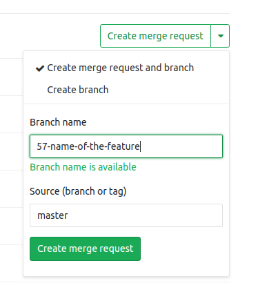

# Contributing to the Project

## Prepare

Clone and setup the repo:

```bash
git clone [target-git-url] [target-folder]

cd [target-folder]

npm install

npx nx build
```

Be sure to have a Issue registered on GitLab Ready for Development to base your contribution

Assign the issue to your user and set the label "flow::In Progress"

Create a new branch on git related to the Issue folowing the naming convention below using only lower case characters:

```text
Format:
[issue_number]-[short-issue-title]

Example:
9999-short-summary-of-the-issue
```

Use the GitLab Web Interface to create the new branch and the corresponding merge request from the correct source branch (main) for the designated issue through the issue details page



Check out the branch that you will created

```bash
git fetch --all

git checkout 9999-your-branch
```

Prepare your local environment before coding

If you are running for the first time, we recommend to run the command 'npm install' with the parameter '--legacy-peer-deps', the reason of that is because we have some dependencies with peer dependencies declared that conflicts with other dependencies

```bash
npm install --legacy-peer-deps
```

or

```bash
npm install
```

```bash
npm run nx:all:build
```

## Coding

Creating a new component

You can use our scaffolding system "plop" to create a new component based on a template using the following command

```bash
npm run plop
```

It will display a prompt as show bellow for to enter the component name

```text
? What is the name of your component? (use spaces if multi word, ex.: Button, Radio Button, etc.)
```

Start coding using the Storybook to test and document your changes

Running Storybook (Documentation & Demos) & Watch Library changes for Hot Reload:

```bash
npm run nx:libs:storybook

http://localhost:4400/
```

## Pushing your Changes

Run the necessary quality validations before push your changes:

Run Build:

```bash
npm run nx:libs:build
```

Run linting:

```bash
npm run nx:libs:lint
```

Run unit tests:

```bash
npm run nx:libs:test
```

You'll be good to go and push your changes if the previous step ran with no errors.

After you've pushed your changes to the respective branch, if you have already the Merge Request opened, the GitLab will trigger automattically a CI Pipeline against your changes to validate, once the pipeline finishes sucessfully you will be able to send it to be reviewed by our core maintainers to approve and merge it to the target branch.
